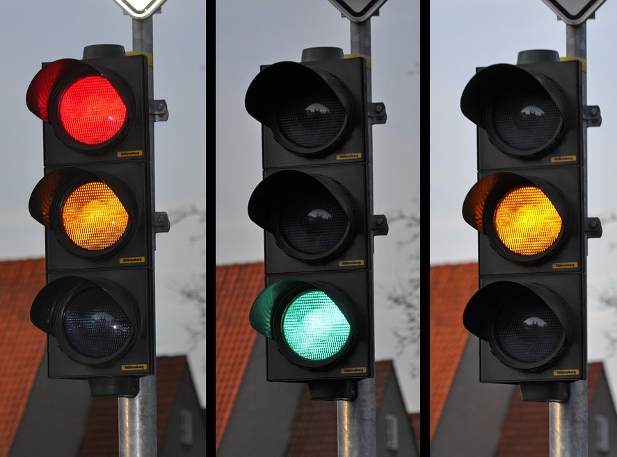

<!DOCTYPE html>
<html>
<head>
<link rel="stylesheet" href="estilos.css">
<title>pagina ahmed</title>

</head>
<body>

   <header>
    
</header>
<nav>
     <ul>
          <li><a href="index.html.html">INICIO</a></li>
          <li><a href="juguete.html.html">JUGUETE</a></li>
          <li class="dropdown">
            <a href="semaforo.html.html" class="dropbtn">SEMAFORO</a>
            

               <a href="semaforo_planteamiento.html">PLANTEAMIENTO</a>
               <a href="semaforo_investigacion.html">INVESTIGACION</a>
              <a href="semaforo_ideacion.html.html">IDEAS</a>
              <a href="semaforo memoria.html.html">DISEÑO</a>
              <a href="semaforo_planificacion.html.html">PLANIFICACIÓN</a>
              <a href="semaforo_construccion.html">CONSTRUCCION</a>
     

           </li>
          </ul>
            
     
        
     
     

</nav>
<article>
     <section>
          

              
EN ESTA PAGINA VAMOS A PUBLICAR TODOS LOS TRABAJOS Y PROYECTOS,
             QUE HEMOS HECHO A LO LARGO DELCURSO EN LA CLASE DE "TECNOLOGÍA"
             DE 3º DE LA ESO.
               

              
              
              
          

     </section>
</article>
<aside>
     

           
           
          
     

</aside>
     <footer>

      
ESTA PAGINA ESTA HECHA POR AHMED

      
© 2024.ESTA PAGINA ESTA LICENCIADA VIA CC-BY 4.0.
 

    
</footer>
</body>
</html>

body {
  background-color: rgb(141, 228, 255);
}
article section div{
 width: 75% ;
 float: left;
 

}
aside div{
  width:25%;
  float:right;

}

img{
  width: 100%;
  height: auto;
  }
  
article section div img {
width: 49%;
height:auto;
  }
  
 nav ul {
   list-style-type: none;
   margin: 0;
   padding: 0;
   overflow: hidden;
  }
  
 nav li  {
    float: left;
    font-size: 24px;
  }
  
  li a {
    display: block;
    color: #000000;
    text-align: center;
    padding: 14px 16px;
    text-decoration: none;
  }
  
  li a:hover:not(.active) {
    background-color: #04AA6D;
  }

li a.active{
 color: rgb(81, 202, 136);
 background-color: bisque;
}

  p {
  font-size: 24px;
  }
  footer div {
    text-align: center;
    float: left;
  } 

  ul {
    list-style-type: none;
    margin: 0;
    padding: 0;
    overflow: hidden;
   
  }
  
  li {
    float: left;
  }
  
  li a, .dropbtn {
    display: inline-block;
    color: rgb(0, 6, 54);
    text-align: center;
    padding: 14px 16px;
    text-decoration: none;
  }
  
  li a:hover, .dropdown:hover .dropbtn {
    background-color: red;
  }
  
  li.dropdown {
    display: inline-block;
  }
  
  .dropdown-content {
    display: none;
    position: absolute;
    background-color: #f9f9f9;
    min-width: 160px;
    box-shadow: 0px 8px 16px 0px rgba(196, 49, 49, 0.2);
    z-index: 1;
  }
  
  .dropdown-content a {
    color: rgb(148, 42, 42);
    padding: 12px 16px;
    text-decoration: none;
    display: block;
    text-align: left;
  }
  
  .dropdown-content a:hover {background-color: #f1f1f1;}
  
  .dropdown:hover .dropdown-content {
    display: block;
  }

